<p align="center">
  <picture>
    <source media="(prefers-color-scheme: dark)" srcset="docs/media/banner-dark.svg">
    
  </picture>
</p>

<p align="center">
  
  
  
  
  
  
</p>

<p align="center">
  <a href="#see-it-work">See it work</a> &nbsp;&nbsp;
  <a href="#how-it-works">How it works</a> &nbsp;&nbsp;
  <a href="#quickstart">Quickstart</a> &nbsp;&nbsp;
  <a href="#try-it-with-the-samples">Try the samples</a> &nbsp;&nbsp;
  <a href="#api">API</a> &nbsp;&nbsp;
  <a href="#known-limits">Known limits</a>
</p>

<br>

**Concord is a consistency gate for a knowledge base.** When a new file is uploaded, it is checked
against everything already in the record. If it contradicts something, the upload is blocked and the
exact file, section, and sentence in conflict are shown side by side, so you can cancel, replace the
old document, or override with a logged reason.

It runs entirely on one machine, on CPU: retrieval narrows the whole record down to a handful of
passages per claim, [Laya](https://huggingface.co/convaiinnovations/laya) makes the fast
contradiction calls, and a small local LLM confirms and explains the few pairs that get flagged.

<br>

## See it work

<p align="center">
  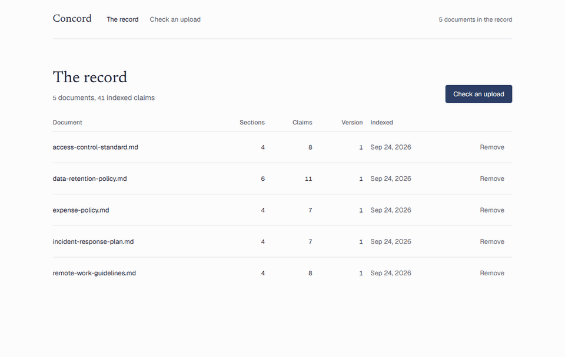
</p>
<p align="center"><sub>The record, then an upload that says logs are kept for 30 days when the record says 90. Audit progress is sped up.</sub></p>

<br>

<table>
  <tr>
    <td width="50%" valign="top">
      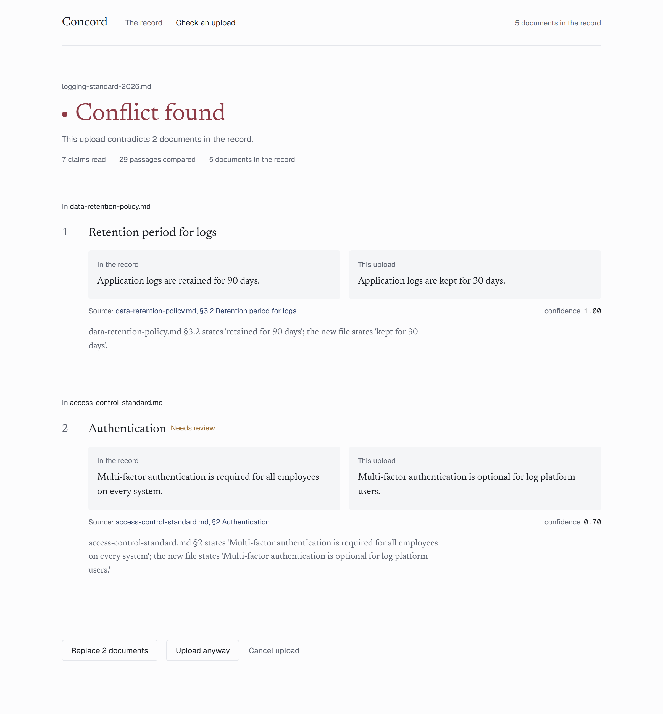
      <p><b>Conflict found.</b> Each finding pairs the passage in the record with the passage in the upload, cites the exact section, and explains the conflict with the real values.</p>
    </td>
    <td width="50%" valign="top">
      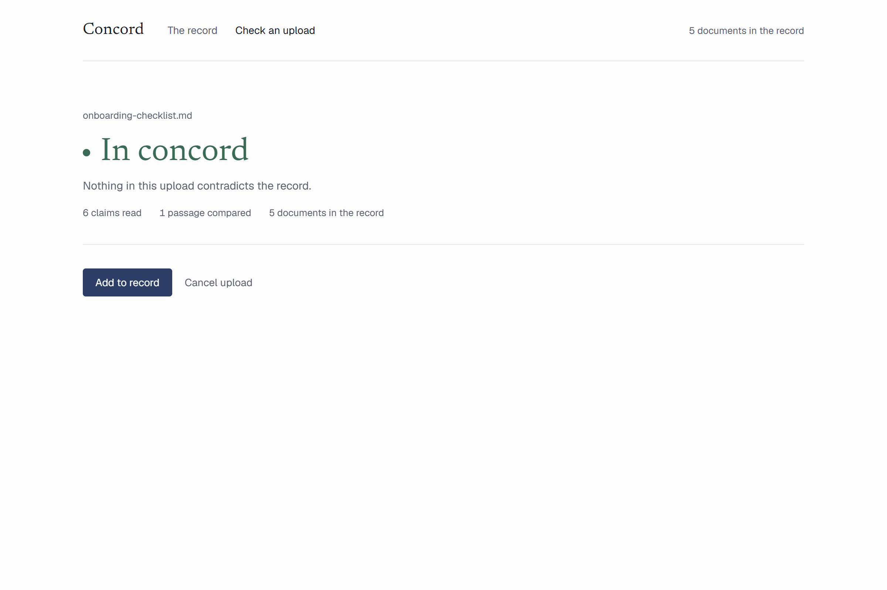
      <p><b>In concord.</b> Nothing contradicts the record. One click adds the file, and it becomes part of what the next upload is checked against.</p>
      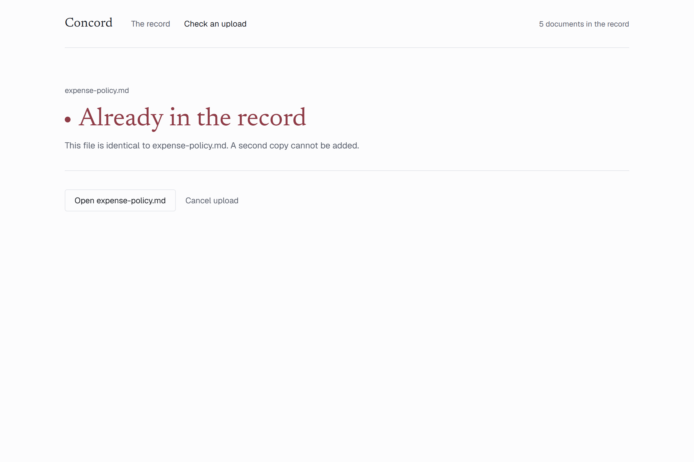
      <p><b>Already in the record.</b> An identical file, or a copy with the same claims, is rejected outright. It cannot be added even with an override.</p>
    </td>
  </tr>
</table>

<table>
  <tr>
    <td width="50%" valign="top">
      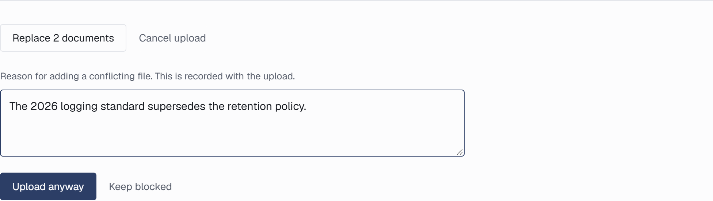
      <p><b>Override, on the record.</b> Adding a conflicting file anyway requires a reason, which is stored with the upload.</p>
    </td>
    <td width="50%" valign="top">
      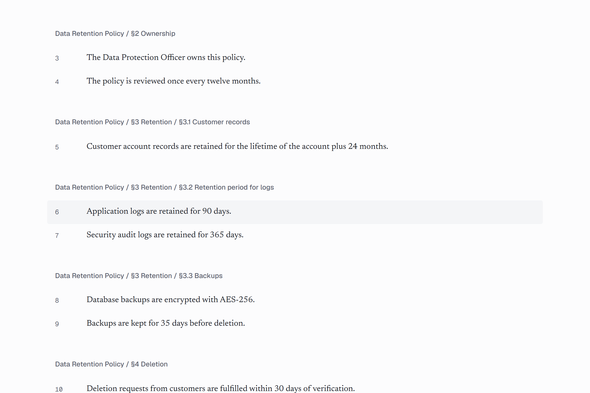
      <p><b>Every citation resolves.</b> Source links open the document at the exact claim, with its section and position.</p>
    </td>
  </tr>
</table>

<table>
  <tr>
    <td width="36%" valign="top">
      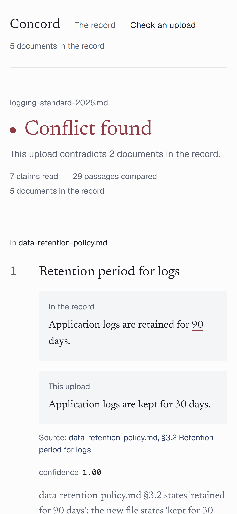
    </td>
    <td width="64%" valign="top">
      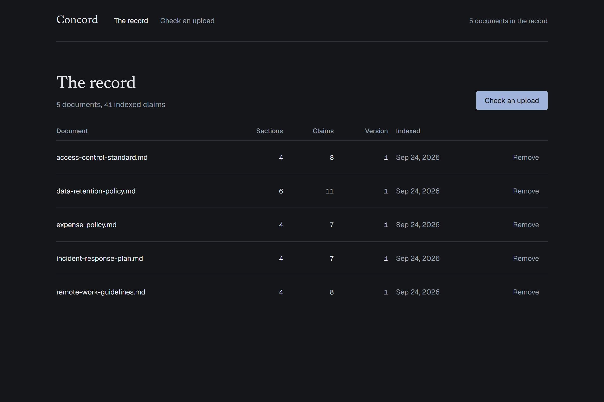
      <p><b>Light and dark, desktop and phone.</b> The interface is ink on paper. Colour appears only to deliver a verdict: claret for a conflict, ochre for review, green for concord. The record is set in a serif; the instrument around it is a neutral sans, with figures in tabular mono.</p>
      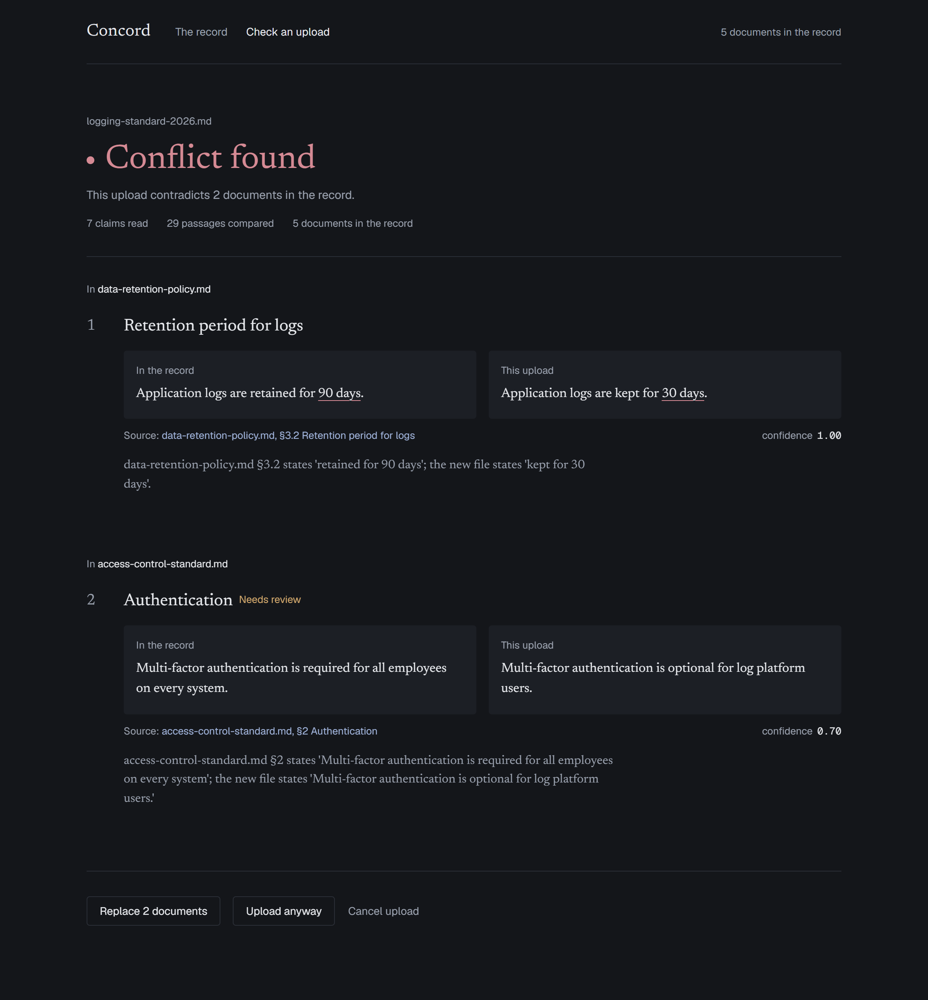
    </td>
  </tr>
</table>

<p align="center">
  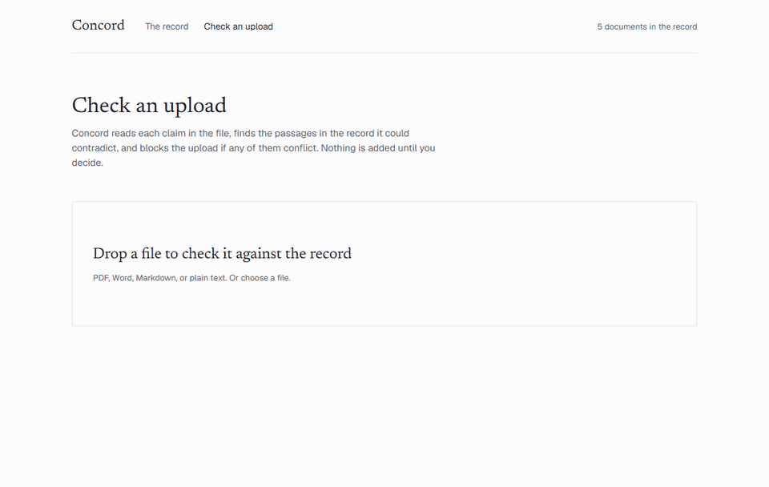
</p>
<p align="center"><sub>Uploading a file that is already in the record.</sub></p>

<br>

## How it works

<p align="center">
  <picture>
    <source media="(prefers-color-scheme: dark)" srcset="docs/media/architecture-dark.svg">
    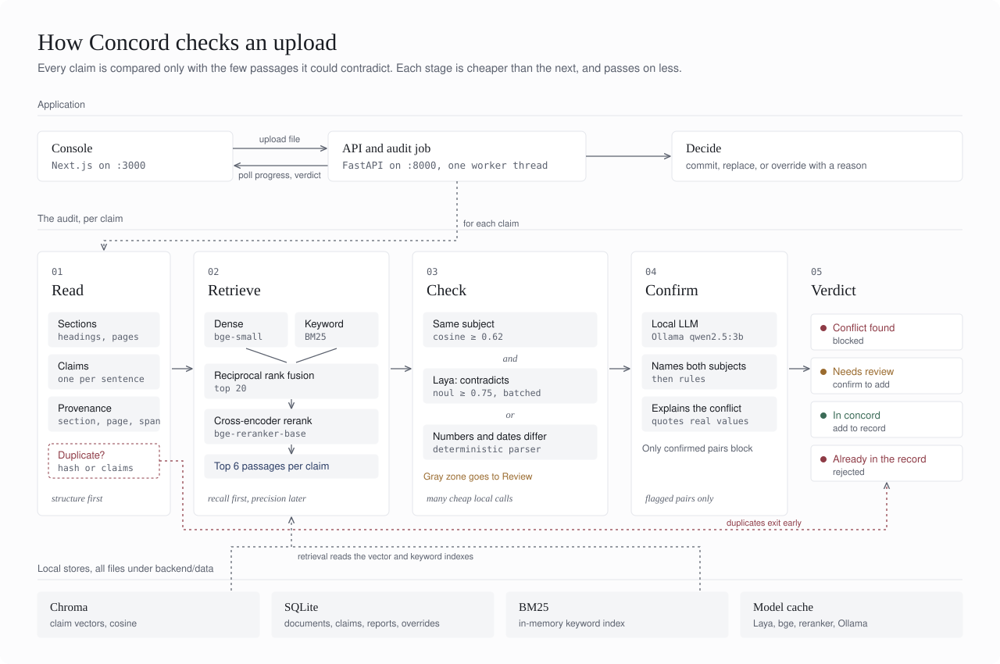
  </picture>
</p>

Comparing one file with hundreds is not one model's job, so the audit is a funnel. Each stage is
cheaper per call than the next and passes on less:

1. **Read.** The upload is split structurally (headings, then paragraphs), then into one claim per
   sentence. Each claim keeps its section path, page, and character span, which is what makes a
   citation like `data-retention-policy.md §3.2` exact. A file whose hash, or whose full set of
   claims, already exists in the record exits here as a duplicate.
2. **Retrieve.** For each claim, dense search (`bge-small-en-v1.5`) and BM25 keyword search each
   return 20 candidates, fused with reciprocal rank fusion and reranked by a cross-encoder
   (`bge-reranker-base`). The top 6 passages per claim go on. Retrieval is the recall ceiling: a
   conflict that isn't retrieved can't be judged.
3. **Check.** A pair is flagged when both passages are about the same thing (embedding cosine
   ≥ 0.62) **and** Laya says they cannot both be true (`contradicts` ≥ 0.75), or when they state
   different figures for the same thing (a deterministic parser for durations, money, percentages,
   dates, and counts). Near misses go to Review. Laya runs batched, locally, many times per upload.
4. **Confirm.** Only flagged pairs reach the local LLM (`qwen2.5:3b` through Ollama). It must name
   the subject of each passage before ruling, then explains the conflict using values quoted from the
   passages. It can clear borderline pairs, but only an LLM-confirmed conflict can block an upload.
5. **Verdict.** Conflict found, Needs review, In concord, or Already in the record.

**Fail safe.** Any model error on a pair routes it to Review, never to "in concord". If Ollama is not
running, flagged pairs go to Review instead of being confirmed.

<br>

## Quickstart

You need Python 3.10 to 3.12, Node 18+, and [Ollama](https://ollama.com).

```bash
ollama pull qwen2.5:3b
```

**Backend** (FastAPI on :8000)

```bash
cd backend
python -m venv .venv
.venv\Scripts\activate            # macOS/Linux: source .venv/bin/activate
pip install --extra-index-url https://download.pytorch.org/whl/cpu torch
pip install -r requirements.txt
uvicorn app:app --port 8000
```

The first run downloads the Laya, embedding, and reranker weights (about 1.5 GB) once. Models load in
the background after startup; `GET /health` reports `"ready": true` when they are in memory. The
Chroma directory and the SQLite file are created under `backend/data/`.

**Frontend** (Next.js on :3000)

```bash
cd frontend
npm install
npm run dev
```

**Seed the record** with your existing files (`.txt`, `.md`, `.pdf`, `.docx`):

```bash
cd backend
python -m ingest ../samples/kb     # or the folder with your own knowledge base
```

Then open [localhost:3000](http://localhost:3000) and drop a file on **Check an upload**.

<br>

## Try it with the samples

`samples/kb/` is a small fictional policy set: data retention, access control, expenses, incident
response, and remote work. `samples/uploads/` has files to check against it.

| Upload | Expected verdict | Why |
|---|---|---|
| `samples/uploads/logging-standard-2026.md` | **Conflict found** | Keeps application logs for 30 days (the record says 90); also makes MFA optional where the record requires it for everyone (Needs review) |
| `samples/uploads/onboarding-checklist.md` | **In concord** | Nothing in it touches the record |
| Any file from `samples/kb/`, renamed or not | **Already in the record** | Duplicate content is rejected |

On a 12-core CPU an audit takes from a few seconds (unrelated files) to about two minutes (files that
need several LLM confirmations).

<br>

## Configuration

Every threshold lives in one place, `backend/policy.py`:

| Setting | Default | Meaning |
|---|---|---|
| `top_n` | `6` | Passages per claim that go on to the contradiction check |
| `tau_subject` | `0.62` | Embedding cosine for "about the same thing" |
| `tau_contra` | `0.75` | Laya `contradicts` probability to flag |
| `contra_band` | `0.15` | Below `tau_contra` by this much, a same-subject pair goes to Review |
| `numeric_subject` | `0.72` | Similarity needed before comparing figures |
| `llm_min_confidence` | `0.6` | LLM confidence needed for a hard block |
| `gray_llm_cap` | `6` | Borderline pairs per upload the LLM may clear (it never escalates them) |

Models are set with environment variables: `CONCORD_EMBED_MODEL`, `CONCORD_RERANK_MODEL`,
`CONCORD_LAYA_MODEL`, `CONCORD_LLM_MODEL`, and `OLLAMA_HOST`. Set `CONCORD_EXTRACT_CLAIMS=1` to have
the LLM rewrite each claim into a self-contained statement at ingest (slower, sometimes more accurate).

<br>

## API

| Method | Path | Purpose |
|---|---|---|
| `POST` | `/uploads/check` | Start an async audit of a file. Returns `{job_id, upload_id}` |
| `GET` | `/uploads/check/{job_id}` | `{status, stage, progress, verdict, conflicts[], documents[], duplicate_of}` |
| `POST` | `/uploads/commit` | `{upload_id, action: commit \| override \| replace, reason?, replace_document_ids?}` |
| `POST` | `/uploads/{upload_id}/cancel` | Discard an upload |
| `GET` | `/documents` | The record |
| `GET` | `/documents/{id}` | One document with its claims and provenance |
| `POST` | `/documents` | Index a file directly (seeding; bypasses the check) |
| `DELETE` | `/documents/{id}` | Remove a document and its chunks |
| `GET` | `/overrides` | Uploads accepted with an override, with their reasons |
| `GET` | `/health` | Model readiness, LLM availability, and the active thresholds |

<br>

## Project structure

```
concord/
├── backend/
│   ├── app.py          FastAPI: async audit job, commit/override/replace, record, health
│   ├── ingest.py       structural chunking, sentence claims, embedding, bulk ingest CLI
│   ├── retrieve.py     dense + BM25, reciprocal rank fusion, cross-encoder rerank
│   ├── contradict.py   Laya contradiction check (batched) and the numeric/date parser
│   ├── adjudicate.py   LLM confirmation and explanation through Ollama
│   ├── policy.py       every threshold, and verdict aggregation
│   └── db.py           SQLite (provenance), Chroma (vectors), BM25 (keywords)
├── frontend/
│   ├── app/            the record, check an upload, document view
│   └── components/     VerdictFinding, PassagePair, AuditProgress, RecordTable, ...
├── samples/            a small knowledge base and test uploads
└── docs/
    ├── diagrams.py     generates the banner and architecture diagram (light and dark)
    └── media/          screenshots and GIFs used in this README
```

<br>

<details>
<summary><b>Discovery notes: what testing Laya changed</b></summary>
<br>

The brief asked for a discovery step before wiring the policy. It changed the design:

- **Result keys are as documented:** `answers[q]["noul"]` is P(true) and `answers[q]["confidence"]`
  its confidence. A pair takes about 0.5 to 0.7 s on CPU; the audit uses `predict_batch`.
- **Instructions must name the state keys** in backticks (`` `existing` ``, `` `new` ``). With
  generic wording, `contradicts` scored near 0 even on direct negations.
- **Laya's `same_subject` tracks agreement, not topic.** "Retained for 90 days" against "kept for 30
  days" scored 0.05. Requiring it alongside `contradicts` removed exactly the conflicts the gate
  exists to catch, so the subject check uses embedding cosine and Laya answers only `contradicts`.
- **The reranker scores a contradiction as irrelevant** (0.002 for "business class is permitted"
  against "business class is never permitted"), so its ranking is fused with the dense and keyword
  rankings rather than used as the final cut.
- **A 3B LLM rubber-stamps conflicts** unless it has to name each passage's subject first. The
  prompt uses a JSON schema that puts the subjects before the ruling, plus a few examples. On a
  labelled set of 16 pairs it went from over-confirming to 14 of 16 correct.

</details>

<br>

## Known limits

- **Retrieval is the ceiling.** A conflict whose passage isn't retrieved is invisible downstream.
- **Some purely semantic contradictions slip through.** In testing Laya missed "reviews are
  blameless" against "reviews assign individual blame". The small LLM also misses exceptions to
  universal rules; those go to Review when Laya's signal is strong.
- **False positives would block real work,** so only LLM-confirmed pairs block, borderline pairs go
  to Review, and an override with a reason is always available.
- **Semantic only.** No external truth and no reasoning across several documents at once.
- **English only** (the English Laya checkpoint).
- **Tune on your own data.** The thresholds were set on a small sample. Build a labelled set of real
  conflicting and non-conflicting pairs from your knowledge base and retune `policy.py`.

<br>

## Regenerating the README media

The banner and architecture diagram are generated from the product's design tokens:

```bash
python docs/diagrams.py
```

The screenshots and GIFs were captured from the running app with a headless browser (Playwright),
using the files in `samples/`.

<br>

<p align="center"><sub>Contradiction checks by <a href="https://huggingface.co/convaiinnovations/laya">Laya</a> from Convai Innovations, Apache-2.0.</sub></p>
